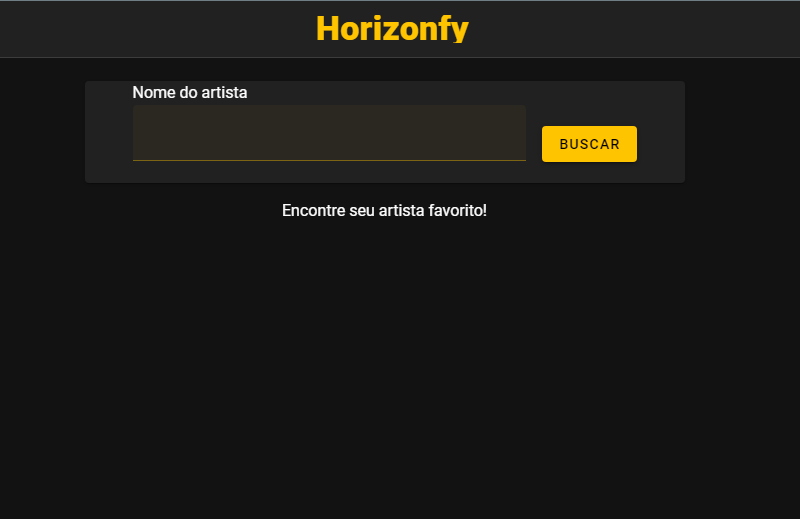

    <h2 align="center"> Horizonfy </h2>
    

  
   

## :pushpin: Sobre

Encontre os álbuns de seus artistas preferidos, veja suas faixas e acesse as infos dessas faixas, tudo em um só lugar.

Aplicação desenvolvida com <a href="https://cli.vuejs.org/">VueJS 3!</a> 

Dependências do projeto

 Gerenciamento de estados: <a href="https://vuex.vuejs.org/">Vuex</a>

 Roteador: <a href="https://v3.router.vuejs.org/">Vue Router</a>

 Cliente HTTP: <a href="https://axios-http.com/docs/intro">Axios</a>

 Biblioteca de interface (css): <a href="https://vuetifyjs.com/en/">Vuetify</a>

Use the application with vercel: <a href="https://horizonfy-two.vercel.app/main">Contact List</a>

## :pushpin: Installation

In the project directory, you can run:

### `npm`

To load project dependencies.

### `npm install`

Runs the app in the development mode.\
Open [http://localhost:5173](http://localhost:3000) to view it in your browser.

The page will reload when you make changes.\
You may also see any lint errors in the console.
